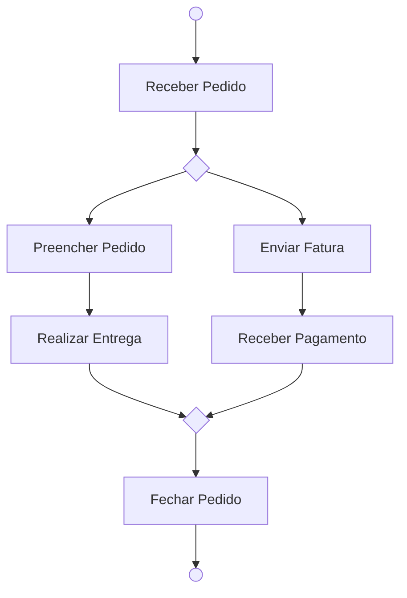

```mermaid
flowchart TD
    A(( )) --> B[Receber Pedido]
    B --> C{ }

    C --> D[Preencher Pedido]
    C --> E[Enviar Fatura]

    D --> F[Realizar Entrega]
    E --> G[Receber Pagamento]

    F --> H{ }
    G --> H

    H --> I[Fechar Pedido]
    I --> J(( ))
```
